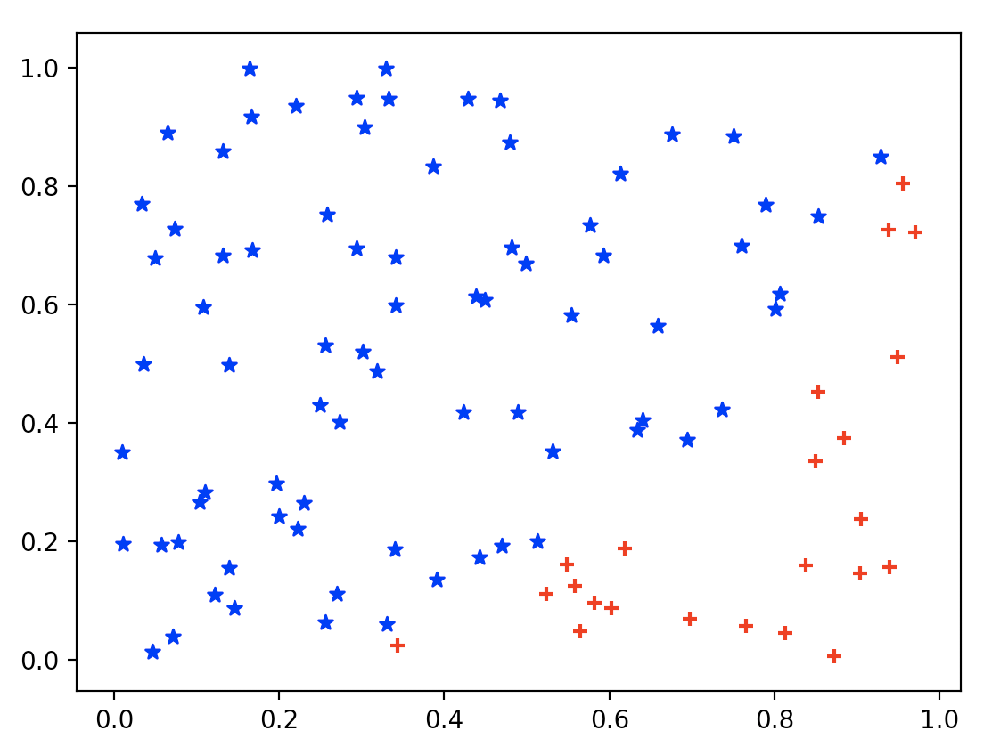

# Data Mining Homework1 Report

> - 17343147 张涵健

## Ex1

|投点数  |20次数据  |均值  |方差  |
|---------|---------|---------|---------|
|20     |[2.8 4.  2.8 3.2 2.6 3.2 3.2 3.4 3.4 3.  3.4 3.2 3.2 3.  2.6 3.2 2.8 3.2 3.2 3.6]         |3.15         |0.1075         |
|50     |[3.04 3.12 3.28 3.28 2.96 3.28 3.12 2.96 2.88 3.12 3.04 2.64 3.52 2.96 3.2  2.8  3.2  3.12 3.28 3.2 ]         |3.1         |0.0376         |
|100     |[3.28 3.04 3.   3.16 3.12 3.32 3.16 3.   3.44 3.6  3.32 2.96 3.2  3.16 3.28 3.24 3.12 3.2  3.2  3.28]         |3.24         |0.02238         |
|200     |[3.14 3.28 3.1  3.06 3.24 3.26 3.12 3.32 3.24 3.2  3.08 3.32 3.36 3.14 3.26 3.   3.3  3.1  3.06 3.08]         |3.183         |0.01085         |
|300     |[3.10666667 3.10666667 3.24       3.10666667 3.14666667 3.24 3.05333333 3.04       3.13333333 3.06666667 3.12       3.02666667 3.         2.96       3.18666667 3.04       2.98666667 3. 3.24       3.13333333]         |3.0967         |0.0069         |
|500     |3.136 3.256 3.168 3.184 3.16  3.104 3.064 3.168 3.112 3.136 3.136 3.184 3.104 3.128 3.168 3.096 3.    3.168 3.048 3.24 ]         |3.138         |0.0035         |
|1000     |[3.172 3.1   3.064 3.132 3.076 3.116 3.12  3.128 3.136 3.124 3.088 3.196 3.144 3.056 3.092 3.112 3.104 3.164 3.168 3.18 ]         |3.1236         |0.00144         |
|5000     |[3.1464 3.1112 3.1608 3.12   3.1432 3.1336 3.1352 3.0832 3.1528 3.1443.136  3.1712 3.144  3.1408 3.1832 3.1488 3.1544 3.1616 3.1152 3.092 ]         |3.139         |0.000585         |

5000点图：

## Ex2

x通过随机数生成器获得

|N  |均值  |方差  |
|---------|---------|---------|
|5     |0.286         |0.039404         |
|10     |0.254         |0.01708         |
|20     |0.2455         |0.008605         |
|30     |0.248         |0.006585         |
|40     |0.254         |0.004350         |
|50     |0.2524         |0.004351         |
|60     |0.24         |0.003361         |
|70     |0.2533         |0.002967         |
|80     |0.2489         |0.002035         |
|100     |0.251         |0.002437         |

100 点图

## Ex3

> 函数最大值出现在（4，1）最小值出现在（2，0），得出测试高度f(4,1)-f(2,0),得出测试体积（2 * 2* h）

|N  |均值  |方差  |
|---------|---------|---------|
|5     |85000.27         |4.8*10^10         |
|10     |65384.82         |2.7*10^10         |
|20     |143846         |1.7*10^10         |
|30     |110064.45        |1.1*10^10         |
|40     |123413.86         |1.1*10^10         |
|50     |98077.24         |5.3*10^9         |
|60     |110064.46         |4.3*10^9         |
|70     |107884.97         |5.4*10^9         |
|80     |114014.79         |5.3*10^9         |
|100     |119981.16         |3.9*10^9         |
|200     |107721.50         |2.1*10^9         |
|500     |115927.30         |7.1*10^8         |