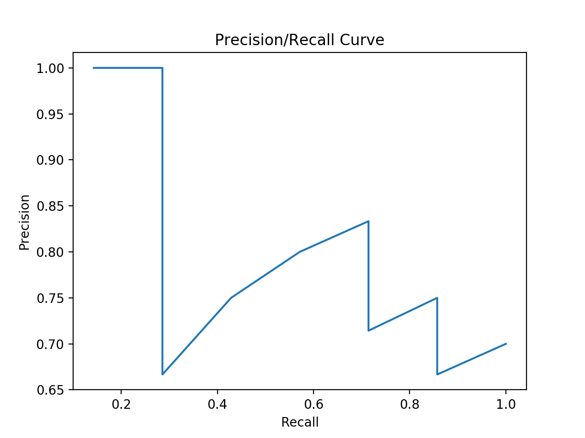
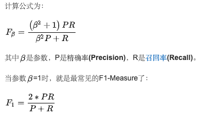

# Homework 2: Evaluation Metrics (Report)

> 17343147 张涵健

## Exercise 1: Rank-based Evaluation Metrics, MAP@K, MRR@K

### （a）

#### Q#1

> - AP@5 = (1/1 + 2/3) * (1/2) = 0.833
> - AP@10 = (1/1 + 2/3 + 3/6 + 4/7 + 5/10) * (1/5) = 0.648
> - RR@5 = 1
> - RR@10 = 1

#### Q#2

> - AP@5 = 1
> - AP@10 = (1/1 + 2/7) * (1/2) = 0.643
> - RR@5 = 1
> - RR@10 = 1

#### Q#3

> - AP@5 = 0
> - AP@10 = (1/6 + 2/7 + 3/10)*(1/3) = 0.251
> - RR@5 = 0
> - RR@10 = 1/6

### （b）

> - MAP@5 = (0.833 + 1 + 0)/3 = 0.611
> - MAP@10 = (0.648 + 0.643 + 0.251)/3 = 0.514
> - MRR@5 = 0.667
> - MRR@10 = 0.722

## Exercise 2:Rank-based Evaluation Metrics, Precision@K, Recall@K, NDCG@K

(a) P@5 = 0.8 ; P@10 = 0.7

(b) R@5 = 1 ; R@10 = 1

(c) 1 2 4 5 6 3 7 8 9 10

(d) 1 2 3 4 5 6 7 8 9 10

(e) 1 2 3 4 5 6 7 8 9 10

(f) 1 2 3 4 5 6 7 8 9 10

(g) 将K设置为1或包含所有perfect的5

(h) AP = (1 + 1 + 3/4 + 4/5 + 5/6 + 6/8 + 7/10) / 7 = 0.833 ; AP是单次Query的平均，MAP是多次Query的AP的平均

(i) 1 2 4 5 6 8 10 3 7 9

(j) NDCG5 = 0.806

(k) 

> (i) 4, 4, 3, 2, 1  
> (ii) idcg: 9.27192;
> (iii) NDCG = DCG / IDCG = 0.805698

(l) CG; CG5 = 14

## Exercise 3: Precision-Recall Curves

## Exercise 4: Other Evaluation Metrics

f-measure是一种统计量，F-Measure又称为F-Score，F-Measure是Precision和Recall加权调和平均，是IR（信息检索）领域的常用的一个评价标准，常用于评价分类模型的好坏。

在f-measure函数中，当参数α=1时，F1综合了P和R的结果，当F1较高时则能说明试验方法比较有效。

