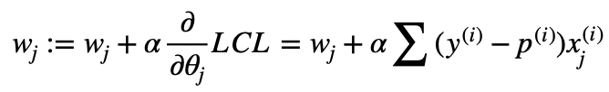

# Homework 3

> 17343147  张涵健

## Exercise 1

### （a）

本题多变量线性回归模型


初始值

```
alpha = 0.00015 # learn rate
theta0 = 0.0
theta1 = 0.0
theta2 = 0.0
```

梯度下降迭代


误差计算


> 分析与结论：
> 
> 使用了4个参数来训练该线性回归模型，其中学习率为 0.00015，其余为0.0。根据迭代计算结果，参数收敛在[ 79.46 6.76 -72.38 ]左右，误差也逐渐稳定降低。


### （b）

> 当保持相同的迭代次数时，将学习率设置为 0.0002，程序数据过大而越界，无法得到理想的训练结果。

把迭代次数减少，使得数据能正常


> 结果也是不能正确收敛。

> 结论：学习影响多变量线性回归模型的收敛，学习率越大，在梯度下降中影响越大，应把学习率适当调小，加快模型收敛，或者将数据进行归一化，统一数据的规模。

### （c）

随机梯度下降迭代


第一次实验


第二次实验


> 误差波动较大，但随着迭代次数的增加，整体呈现下降趋势，但仍然存在特别大的波动。随机梯度下降对于训练样本有较大的随机波动性，存在重复样本过多的可能性，导致数据与理想的批量梯度下降有区别。优点是训练时间较快。

## Exercise 2

### (a)

- Sigmoid 函数 （逻辑函数）


- 逻辑回归模型（概率模型+线性回归）


- y符合二项分布，对应条件对数似然函数


### (b)

- 对 w0 求导后


- 对 wj 求导后


- 进行梯度下降迭代（theta 换 w, p为关于w，x的函数）



### (c)

由于训练数据比ex1大的多，因此使用随机梯度下降减少训练时间。


训练结果使用错误率表示

> 错误分类/样本总数

- **测试参数**

迭代次数以 20 次迭代为单位记录一次，共记录15次，学习率调整为0.002


### (d)

在迭代次数足够多时为0

### (e)

收敛至少需要 30000 次迭代


### (f)


> 统一参数和迭代次数下，随着测试样本的增加，错误率逐渐降低，但由于样本的随机选取性，存在错误率提高的波形，但整体还是下降趋势的。